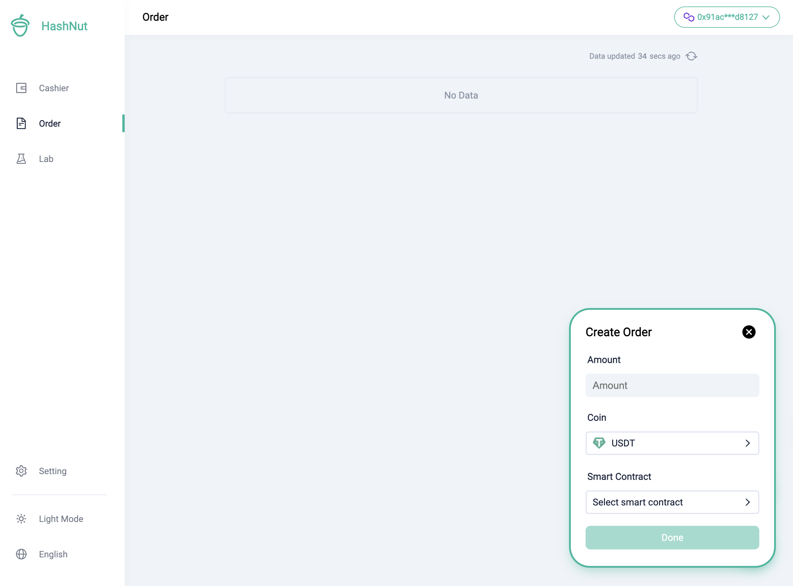
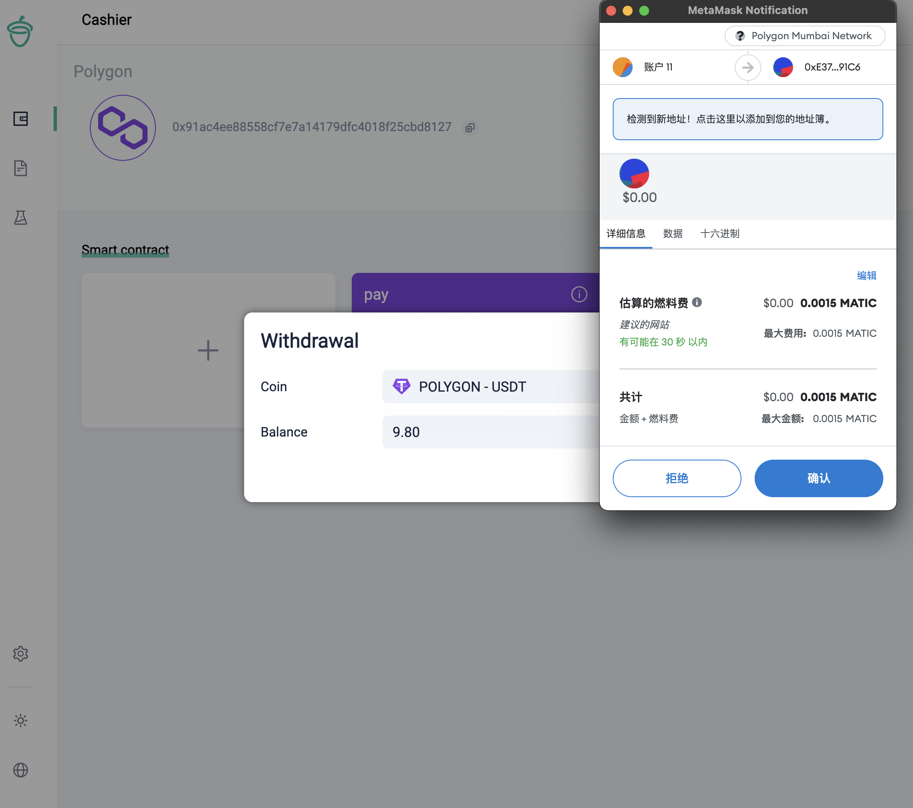

# 商户操作步骤和概念
## 商户登录
### 1.准备钱包和插件
文本介绍在 PC 上 chrome 进行操作，需安装两个插件，这些插件和您接下来的操作有关，如果您不想使用这些插件，可使用手机钱包。
* [metamask](https://metamask.io/) 支持 ETH , BSC , Polygon 等链
* [tronlink](https://www.tronlink.org/) 支持 TRON 链  
安装完成之后，在浏览器右上角会出现一个小图标，点击进入插件，如果是第一次使用，需要创建一个钱包，这里不再赘述，如果您已经有钱包了，可以直接导入。

### 2. 选择适合你的链
每一条链有不同的手续费，也有不同的确认速度，每条链上需创建一个智能合约才能进行收款。

* [BSC](https://bscscan.com/) 手续费低，确认速度快。
* [TRON](https://tronscan.org/) 手续费低，确认速度快。
* [Polygon](https://polygonscan.com/) 手续费最低，确认速度快。
* [ETH](https://etherscan.io/) 手续费较高，确认速度较慢，相对较权威。

您在 metamask 创建一个账号，则支持在 ETH，BSC，Polygon 等链上进行操作，但是你在 tronlink 创建一个账号，则只能在 TRON 链上进行操作。
因此在选择 ETH , BSC , Polygon 等链时，您可以创建一个账号在不同的链上进行操作，也可以创建多个账号在不同的链上进行操作。

### 3. 签名登录到商户平台
这一步是为了证明这个钱包属于您，如您是第一次登录，需要签名，签名成功后，即可登录。

## 商户操作
### 1. 智能合约
智能合约是用来收款的，您需要在您选择的链上创建一个智能合约，此后可创建订单来进行收款。和传统的收款模式不同的是，您完全不必担心资金的安全问题，因为智能合约是由您的钱包创建的，也只有这个钱包的归属人才有权限操作这个智能合约的资金。因此只要保证您的钱包安全，您的资金就是安全的。为了方便识别，您可在创建智能合约时为其命名，这样就可以在商户平台上看到这个智能合约的名字，方便识别。

这一步防止参数被中间人篡改，需要进行签名校验，签名成功之后，才能创建成功。

这里您需要准备一些 BNB , TRX , MATIC , ETH 等加密货币，因为创建智能合约需要消耗一些手续费。

等待确认之后，您用于收款的智能合约成功生成

如果进度显示为 100%，但是没有展示智能合约，可以点击刷新按钮，刷新一下。

### 2. 创建一个订单
为方便整个使用流程，在商户平台切换到 order 页面，可以点击创建订单，然后填写订单信息，点击创建订单，就可以创建一个订单了。

您可以在订单列表中看到您创建的订单，点击复制按钮，把订单链接复制下来，然后发送给您的客户。

### 3. 付款
按照提示打开对应的 APP 即可对订单进行付款

支付完成并且确认之后，您就可以在订单列表中看到订单的状态变为已完成。

同时在首页，您可以看到智能合约的余额已经由 0 变成了 9.8。

### 4. 提现

点击提现按钮，选择您需要提现的币种，即可以进行提现，提现的钱账户进入您的钱包，需要妥善保管好钱包。

由于每次提现需要 gas fee，因此您需要在账户上备足 gas fee，否则提现会失败。

## 关于测试网
[点击前往 测试网 ](https://testnet-web3.hashnut.io/)   
测试网流程和正式网一致，在开发期间为能避免开发者支付 gas fee，我们提供了测试网，测试网的币种是测试币，不会产生实际的费用，但是测试网的智能合约和正式网的智能合约是不同的，因此测试网的智能合约无法在正式网上使用。
目前测试网支持 POLYGON , TRON 两条链。如需测试可以联系我们的工作人员获取一些测试币。

## 文档
[点击前往 文档 ](https://testnet-web3.hashnut.io/docs/cn/api/api.html#%E6%9F%A5%E8%AF%A2%E8%AE%A2%E5%8D%95%E4%BF%A1%E6%81%AF)
